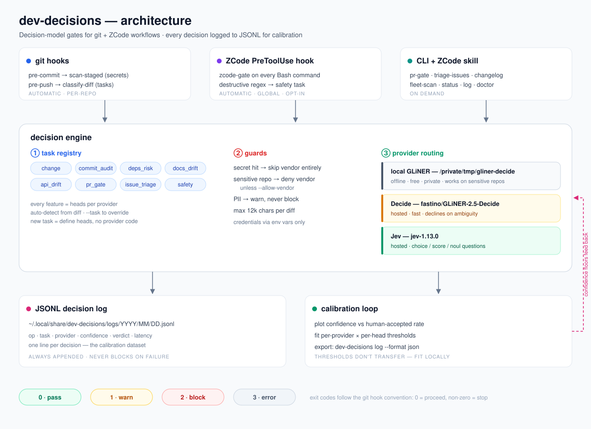
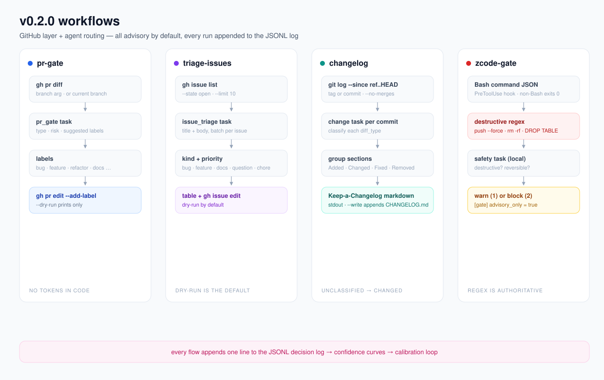
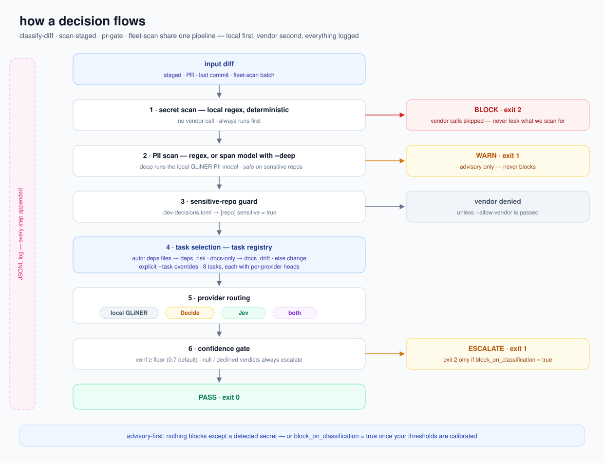

# dev-decisions

Decision-model gates for git + ZCode workflows. Scans secrets/PII from commits, classifies diffs using multiple providers, gates plans/evidence/docs/architecture as contracts, and logs every decision and graded outcome to JSONL for calibration.

**v0.3.0** — provider telemetry, live dashboard, feedback loop for calibration, ModernBERT eval provider.

## Architecture

Three layers, each independently useful:

| Layer | What it does | When it runs |
|---|---|---|
| **git hooks** | `pre-commit` → `scan-staged` (block secrets); `pre-push` → `classify-diff` | Automatic, per-repo |
| **ZCode hook** | `PreToolUse` on Bash → blocks agent-run `git commit`/`git push` if scan/classify fails | Automatic, global (opt-in) |
| **CLI** | All subcommands, invocable from ZCode skill or terminal | On-demand |

Shared JSONL log at `~/.local/share/dev-decisions/logs/YYYY/MM/DD/events.jsonl` is the calibration dataset.



## Providers

| Job | Model | Why |
|---|---|---|
| Diff classification (default) | **auto → sys1 routing** | Roster chain `glide, drex, jev` from `~/.config/sys1/config.toml`; per-task overrides; falls back to `decide` without sys1 |
| Routed default head | **GLiDE** (`glide`, fastino) | Cheap Jev-class default; long inputs size-gate to drex |
| Long-context judgments | **Drex** (`drex-v1.5`, nace) | 131k-token states |
| Contract gates + fan-out | **Jev** (`jev-1.13.0`, typesafe) | Choice/Score/Noul, fan-out native |
| Classification | **GLiNER2.5-Decide** (fastino hosted) | Structured labels: diff type · risk · suggested labels |
| Extraction | **GLiNER2.5** (fastino hosted) | Span extraction — PII redaction for `scan-staged --deep`; a different model from Decide, different use |
| Bulk triage | **Julia** (`julia-1`, supersoniclabs) | Cheapest hosted; calibrated out of the default chain (1/6 agreement) — bulk or by-task only |
| Eval only (not in active roster) | **ModernBERT** | Calibration comparison, kept available |

### Candidate models (opt-in, via sys1 flags)

`--provider` accepts every provider `sys1` registers, including candidate
models that are wired but disabled by default: **CLM-8B** (`clm`),
**openjev/JevK5** (`openjev`), **Kev** (`kev`), **Tev1** (`tev1`),
**Laya** (`laya`), and the GLiNER variants **`decide_1b`** /
**`decide_multi`**. Turn one on in `~/.config/sys1/config.toml`
(`providers.enabled = "core,clm"`) or flip it live in the sys1 control
dashboard (`GET /dashboard` on the sys1 service, port 8400), then point its
`{id}_api_url` / `{id}_model` / key env at your endpoint. Use `all`, `core`,
`optin`, or `candidates` as fan-out tokens. `dev-decisions providers`-style
inspection lives in the sys1 CLI: `sys1 providers --all`, `sys1 doctor`.

## API keys for git hooks

Git hooks don't inherit your shell environment. `install-hooks` wires every
hook it manages to source an optional key file:

```bash
# ~/.config/dev-decisions/env  (chmod 600; one KEY=value per line)
FASTINO_API_KEY=...
TYPESAFE_API_KEY=...
```

With `FASTINO_API_KEY` present, `pre-push` (classify-diff) reaches the
hosted Fastino API; without it the hook warns and proceeds (fail-open by
design). `pre-commit` (scan-staged) is fully local and needs no keys.

## Local GLiNER2.5-Decide setup (supported by design, not encouraged)

The `local` provider runs `fastino/GLiNER2.5-Decide` through
`sys1` using the fastino-prescribed classification API (one decode for all
heads, full probabilities), in a standalone uv venv (default
`/private/tmp/gliner-decide`) — fully offline, free, and safe for sensitive
repos. `/private/tmp` is wiped on reboot; move it elsewhere via
`providers.local_venv` if you want it to survive. For a load-once server
(recommended: ~10s model load per call → ~150ms steady-state), see
`service/classifier_server.py` in the sys1 repo and set
`providers.local_server_url`.

```bash
# 1. Create the venv (Python ≤ 3.12 — GLiNER2 needs torch that 3.13/3.14 lack)
uv venv --python 3.12 /private/tmp/gliner-decide

# 2. Install gliner2 + CPU torch into it
uv pip install --python /private/tmp/gliner-decide/bin/python "gliner2[local]"
uv pip install --python /private/tmp/gliner-decide/bin/python torch --index-url https://download.pytorch.org/whl/cpu
uv pip install --python /private/tmp/gliner-decide/bin/python protobuf

# 3. Models download from Hugging Face on first use and are cached:
#    fastino/GLiNER2.5-Decide                  (classification)
#    fastino/gliner2-privacy-filter-PII-multi  (scan-staged --deep span extraction)
```

Point the CLI at a different venv or model in config:

```toml
[providers]
local_venv = "/private/tmp/gliner-decide"
local_model = "fastino/GLiNER2.5-Decide"
modernbert_model = "answerdotai/ModernBERT-base"
```

## ModernBERT eval provider

ModernBERT runs as a **sentence encoder** inside the same uv venv. It encodes the diff once, then scores each candidate label by cosine similarity against the label's standalone embedding. No fine-tuning — this is calibration data collection.

```bash
# Run ModernBERT on a diff
dev-decisions classify-diff --provider modernbert --task change

# Fleet scan with ModernBERT
dev-decisions fleet-scan --provider modernbert
```

Results are logged with provider tag `modernbert_raw` so they can be filtered from production metrics. The inline script captures `all_scores`, `top2_gap`, and `embedding_norm` per head — these are the signals that tell you what fine-tuning would need to improve.

## Task registry

Every feature is a named task with provider-specific heads. Add new tasks by defining heads — no provider-code changes.

| Task | Auto-detected when | Use |
|---|---|---|
| `change` | default | Diff type + risk |
| `commit_audit` | always | Message accuracy |
| `deps_risk` | deps files touched | Bump level + breaking |
| `docs_drift` | docs-only diff | Behavior change + docs updated |
| `api_drift` | always | Public API + breaking + severity |
| `pr_gate` | `pr-gate` command | Change type + risk + labels |
| `issue_triage` | `triage-issues` command | Kind + priority |
| `safety` | `zcode-gate` destructive patterns | Destructive + reversible |
| `plan_gate` | `plan-gate` command | Criterion coverage + verifiability |
| `evidence_gate` | `evidence-gate` command | Evidence sufficiency + consistency |
| `docs_gate` | `docs-gate` command | Artifact coverage + staleness |
| `arch_gate` | `arch-gate` command | Claim vs documented architecture |
| `plan_surface_map` / `plan_deps` | `plan-surface` command | Criterion->module map / pairwise criterion order |



## Contract gates

Six corpora, one pattern: the model judges, code counts, negative verdicts are
advisorial until calibrated, and every negative requires a recorded human
disposition (`dev-decisions disposition <gate> <target> --status
fixed|waived|overridden --reason ...`). SKILL.md carries the full detail per
gate; the short version:

| Gate | Checks | Negative verdict |
|---|---|---|
| `plan-gate` | per-criterion coverage (noul) + verifiability + section scope creep; `--tests <root>` adds criteria-vs-test-suite matching; `--draws 3` (default) merges self-consistency draws and marks `/UNSTABLE` flags | `GAPS` (exit 1) |
| `evidence-gate` | per-criterion evidence sufficiency + consistency from `== C<i> ==` tagged blocks; fail-closed (missing evidence is never a pass) | `NOT-SUPPORTED` |
| `docs-gate` | linked-artifact coverage + change-induced staleness (removed doc lines vs the diff) | `GAPS` |
| `arch-gate` | plan claims vs TECHNICAL-DOCUMENTATION.md; low documented = UNDOCUMENTED (conventions gap, never an accusation) | `DRIFTS` |

Dispositions close the calibration loop by themselves: since 2026-10-02 the
disposition command looks up the matched gate event (within 30 days) and
writes per-head feedback rows — `fixed`/`waived` grade the prediction correct,
`overridden` inverts it. Gate rows carry `input_sha256` and per-head answers
so the pairing joins cleanly.

## UX corpus (ux-surface + ux-gate)

The plan-surface pattern applied to UI: route contracts in `docs/ux/*.md`
(states matrix + control inventory, authored from the design) are judged
against rendered captures from the ux-capture kit (playwright pixels + DOM +
a VLM capture layer, triangled against the DOM as a code-side witness).
`ux-surface` builds the routes x designed-states x verification artifact;
`ux-gate` gates it — human-graded confirmed drift fails, ungraded flags
warn, semantic state-match stays WARN-only until calibrated.

```bash
dev-decisions ux-surface my-app --ux-docs docs/ux
dev-decisions ux-gate my-app
```

## Plan reconcile + calibration

`plan-reconcile <plan.md>` grades a plan's surface artifact against its actual commits (tau, edge precision, feedback rows). `calibration` reports per-head graded-row counts, accuracy curves, and floor-fit readiness across both feedback stores. See SKILL.md for detail.

## Plan surface

`plan-surface` is the feed-forward counterpart of `plan-gate`: it precomputes the judgment graph a plan decomposer should assemble against — criterion-to-module mapping, pairwise criterion dependencies with confidences, thresholded DAG with topological order, uncertain band, risk flags — and writes the artifact to `~/.local/share/dev-decisions/surfaces/`. See SKILL.md ("Plan surface") for the layer detail and calibration notes.

```bash
dev-decisions plan-surface docs/plans/2026-10-02-feature.md --repo-root .
```

## Telemetry and dashboard

Every provider call now emits structured telemetry: latency, error kind, token usage (Decide), noul/null rates (Jev/local), top2-gap and embedding norm (ModernBERT). All signals flow into the JSONL log.

```bash
# Start the live local dashboard
dev-decisions dashboard --port 8765

# Open http://localhost:8765 to see:
#   - provider health (calls, errors, latency p50/p95 + latency distribution histogram)
#   - confidence histograms per provider (coarse 6-bin + fine 20-bin spread)
#   - ModernBERT signals (top2-gap spread + embedding-norm spread histograms)
#   - cross-provider agreement matrix
#   - calibration curves (once you add feedback)
```

## Feedback loop (calibration ground truth)

The dashboard shows confidence distributions, but the only way to know if a provider is *correct* is to record human feedback:

```bash
# After a classify-diff run, find the input_sha256 in the log:
dev-decisions log --format json | jq -r '.[-1].input_sha256'

# Record the correct label:
dev-decisions feedback <sha> --task change --label fix --provider modernbert_raw --note "clear typo fix"
```

The dashboard joins feedback with events on `(input_sha256, task)` to compute confidence-vs-correctness curves per provider. This is the signal that drives fine-tuning decisions: if ModernBERT's high-confidence predictions are wrong more often than Decide's, the encoder needs training.

## Install

```bash
# Clone
git clone https://github.com/adelvillar1/dev-decisions.git
cd dev-decisions

# Install CLI
mkdir -p ~/.local/bin
cp dev-decisions ~/.local/bin/dev-decisions
chmod +x ~/.local/bin/dev-decisions

# Install config (optional)
mkdir -p ~/.config/dev-decisions
cp config.example.toml ~/.config/dev-decisions/config.toml

# Install hooks in a repo
dev-decisions install-hooks /path/to/repo

# Fleet install: all repos under ~/Projects
dev-decisions bulk-install

# Check environment
dev-decisions doctor
```

## Usage

```bash
# Fleet status across ~/Projects
dev-decisions status

# Scan staged diff for secrets/PII
dev-decisions scan-staged
dev-decisions scan-staged --deep   # PII span model (fully local)

# Classify a diff (default: local fastino GLiNER2.5-Decide via sys1)
dev-decisions classify-diff
dev-decisions classify-diff --provider decide   # hosted fallback (FASTINO_API_KEY)
dev-decisions classify-diff --provider jev
dev-decisions classify-diff --task deps_risk   # explicit task
dev-decisions classify-diff --allow-vendor     # one-off vendor call on a sensitive repo

# PR gating (local-first)
dev-decisions pr-gate [branch] --dry-run
dev-decisions pr-gate 123 --provider local
dev-decisions pr-gate --diff-file patch.diff --fanout   # offline, per-file heads

# Contract gates (advisorial; negatives need dispositions)
dev-decisions plan-gate docs/plans/2026-10-02-feature.md
dev-decisions plan-gate plan.md --tests tests/          # + criteria-vs-suite matching
dev-decisions evidence-gate plan.md closeout-evidence.md
dev-decisions docs-gate plan.md --diff main..HEAD
dev-decisions arch-gate plan.md --repo-root .

# Record the human decision on a negative verdict (writes calibration rows)
dev-decisions disposition plan-gate plan.md --status waived --reason "..."

# Precompute the decomposition surface for a plan, grade it after shipping
dev-decisions plan-surface docs/plans/2026-10-02-feature.md --repo-root .
dev-decisions plan-reconcile docs/plans/2026-10-02-feature.md --repo-root .

# Per-head graded-row counts and floor-fit readiness (both feedback stores)
dev-decisions calibration            # add --format json for machines

# Self-tests (stdlib unittest; no pytest needed)
python3 scripts/selftest.py

# Issue triage (dry-run by default)
dev-decisions triage-issues [owner/repo] --limit 20
dev-decisions triage-issues --state all --dry-run

# Changelog generation
dev-decisions changelog --since v0.1.0
dev-decisions changelog --since v0.1.0 --write

# Fleet scan for API drift
dev-decisions fleet-scan --root ~/Projects --provider local

# View decision log (your calibration dataset)
dev-decisions log --tail 20
dev-decisions log --format json > calibration.jsonl

# Record human feedback for calibration
dev-decisions feedback <sha> --task change --label fix --provider modernbert_raw

# Start the live telemetry dashboard
dev-decisions dashboard --port 8765

# Show the effective merged config (defaults ← global ← repo ← env)
dev-decisions config

# Environment check: python, git, keys, config, hooks, log dir
dev-decisions doctor

# Remove hooks
dev-decisions remove-hooks /path/to/repo
```

## How a decision flows

`classify-diff`, `scan-staged`, `pr-gate`, and `fleet-scan` share one pipeline: local secret scan first, then guards, then the task registry, then provider routing, then the confidence gate. Every step is appended to the JSONL log.



## ZCode agent routing

`zcode-gate` reads JSON from stdin (PreToolUse hook). It:

1. Fast-exits on non-Bash commands.
2. Strips inert spans (quoted text, heredoc bodies) from the command and
   matches destructive patterns against the skeleton — a grep ARGUMENT or a
   commit MESSAGE quoting dangerous words does not trip the gate. Quoted
   spans after interpreter flags (`psql -c 'DROP TABLE ...'`, eval, exec)
   stay in the skeleton: they execute. (2026-10-02: 8 graded false
   positives, two at block severity, all fixed by this.)
3. On a pattern hit, runs the `safety` task through sys1's router to refine
   reversibility. Destructive AND irreversible — or high-stakes
   (force-push/DROP TABLE/kubectl delete) with unknown reversibility —
   hard-blocks (exit 2) regardless of `advisory_only` (the HITL policy:
   negative verdicts with no favorable cost asymmetry).
4. `--no-verify` is a hook bypass, not a destructive op: advisory
   `hook_bypass` flag, never a block.
5. Benign non-commit commands log a `verdict: clean` true-negative row
   (the calibration counterweight to pattern hits).
6. With `advisory_only = true` (default): lower-stakes destructive hits warn
   but proceed (exit 1). With `advisory_only = false`: blocks (exit 2).
7. On `git commit`/`git push`: runs `scan-staged` / `classify-diff` and
   returns their exit code.

Every verdict row carries `input_sha256` (of the full command), the safety
`heads`, `patterns_hit`, and `hook_bypass` — so human grading can join
against exactly what the gate saw.

```json
{
  "tool_name": "Bash",
  "tool_input": { "command": "git push --force origin main" }
}
```

Config in `~/.config/dev-decisions/config.toml`:

```toml
[gate]
advisory_only = true   # true = warn+proceed; false = block
```

## Safety rules

1. **Secrets always block** (local, deterministic, no vendor call).
2. **PII warns only** — never blocks; `git commit --no-verify` documented in output.
3. **Vendor guard**: local scan runs first; any secret hit → vendor call skipped (don't leak what we're scanning for).
4. **Sensitive repos**: `.dev-decisions.toml` with `sensitive = true` → vendor calls denied unless `--allow-vendor` is passed.
5. **Credentials**: env vars only (`FASTINO_API_KEY`, `TYPESAFE_API_KEY`). Never in source, args, logs, or output.
6. **Max diff chars**: default 12k; configurable per repo.

## Exit codes

| Code | Meaning |
|---|---|
| 0 | Pass |
| 1 | Warn (advisory, human review recommended) |
| 2 | Block |
| 3 | Error |

Matches git hook convention: `0` = proceed, non-zero = stop.

## Config precedence

Defaults ← `~/.config/dev-decisions/config.toml` ← `.dev-decisions.toml` (repo) ← `DEV_DECISIONS_*` env vars.

## Config reference

This is the full set of knobs (mirrors [`config.example.toml`](config.example.toml)):

```toml
[scan]
block_on_secret = true        # exit 2 on a secret hit
warn_on_pii = true            # exit 1 on a PII hit (never blocks)
max_diff_chars = 12000        # truncate diffs before scanning/classifying

[classify]
provider = "decide"           # decide | jev | local | both
block_on_classification = false
confidence_floor = 0.7
escalate_on_null = true
allow_vendor_on_sensitive = false

[providers]
decide_api_url = "https://api.fastino.ai/v1/chat/completions"
decide_model = "fastino/GLiNER-2.5-Decide"
jev_api_url = "https://api.typesafe.ai/v1/systemone"   # NOT the chat shape
jev_model = "jev-1.13.0"
local_venv = "/private/tmp/gliner-decide"
local_model = "fastino/GLiNER2.5-Decide"
request_timeout_seconds = 30
max_retries = 2
retry_backoff_seconds = 5

[hooks]
pre_commit = "scan-staged"
pre_push = "classify-diff"

[gate]
advisory_only = true          # true = warn+proceed (exit 1); false = block (exit 2)
```

Repo-local `.dev-decisions.toml` supports one extra flag: `[repo] sensitive = true` denies all vendor calls for that repo.

## Troubleshooting

| Symptom | Fix |
|---|---|
| `FASTINO_API_KEY not set — skipping Decide` | `export FASTINO_API_KEY=…`, or run with `--provider local` (no key needed) |
| `Local GLiNER venv not found at …` | Create it (see [Local GLiNER setup](#local-gliner-setup)) or point `providers.local_venv` at an existing one. `/private/tmp` is wiped on reboot |
| `error: gh CLI required` | `brew install gh && gh auth login` |
| `Repo is marked sensitive — vendor classification skipped` | Intended. Pass `--allow-vendor` for one call, or set `allow_vendor_on_sensitive = true` |
| Decide returns `null` on a head | Not an error — the model declined (usually a short/ambiguous diff). Treat as low signal; nulls escalate |
| Jev calls fail or return unexpected shapes | Jev uses `POST /v1/systemone` with `{state, questions, model}` — not the OpenAI chat shape. Check `providers.jev_api_url` |
| Commits feel slow on huge diffs | Lower `scan.max_diff_chars` (e.g. 6000); the local regex scan is fast, vendor calls scale with size |
| Python 3.13/3.14 + local provider | The stdlib CLI runs on any python3 ≥ 3.10, but GLiNER2's torch needs the 3.12 venv (see setup above) |

## JSONL log schema

```json
{
  "ts": "2026-09-26T...",
  "op": "classify-diff",
  "repo": "my-project",
  "trigger": "git-pre-push",
  "provider": "both",
  "providers_used": ["decide", "jev"],
  "input_chars": 1234,
  "input_sha256": "abc123...",
  "heads": { "decide": {...}, "jev": {...} },
  "verdict": "escalated",
  "escalated": true,
  "latency_ms": 1234,
  "task": "deps_risk",
  "labels": ["bug", "feature"],
  "destructive": true,
  "reversible": "no",
  "advisory_only": true,
  "telemetry": {
    "decide": {
      "latency_ms": 820,
      "http_status": 200,
      "retries": 0,
      "token_prompt": 512,
      "token_completion": 128,
      "token_total": 640,
      "structured_ok": true
    },
    "modernbert_raw": {
      "latency_ms": 7800,
      "error_kind": null,
      "top2_gap": 0.12,
      "embedding_norm": 1.0
    }
  }
}
```

New fields in v0.2.0: `task`, `labels`, `destructive`, `reversible`, `advisory_only`.

New fields (2026-10-02): gate rows carry `input_sha256` + per-head `heads`
(zcode-gate also `patterns_hit`, `hook_bypass`, `task: safety`; plan-gate
`draws`/`unstable`; arch-gate `claim_texts`); classify-diff rows carry
`overridden` (mechanical pushdowns); zcode-gate gains `verdict: clean`
true-negative rows for benign non-commit commands. Dispositions pair with
their gate event to write graded rows into
`logs/feedback/feedback.jsonl` (schema: `input_sha256`, `task`, `provider`,
`label`, `head_id`, `note`).

New fields in v0.3.0: `telemetry` (per-provider dict with latency, error_kind, token usage, structured_ok, top2_gap, embedding_norm, null_label_count, noul_count). Feedback records go to `logs/feedback/feedback.jsonl` and are joined on `input_sha256` + `task` for calibration curves.

## Calibration loop

After a few weeks, the JSONL log contains (input, model, confidence, human-outcome) pairs:

1. Export log: `dev-decisions log --format json > calibration.jsonl`
2. For each provider × head, plot confidence vs human-accepted rate.
3. Set per-provider per-head floor from the curve (thresholds don't transfer — fit locally).

## Tests

`python3 scripts/selftest.py` — stdlib unittest, no pytest. Covers the
zcode-gate skeleton (all 8 graded false positives from 2026-10-02 must stay
clean; real destructive commands must still hit), plan-gate draw merging,
path-based task routing, the docs-only pushdown, and disposition feedback
pairing.

## Requirements

- Python 3.10+ (stdlib-only core)
- git
- For hosted providers: `FASTINO_API_KEY` and/or `TYPESAFE_API_KEY` env vars
- For local provider: `gliner2` installed in a compatible venv

## License

Apache-2.0
